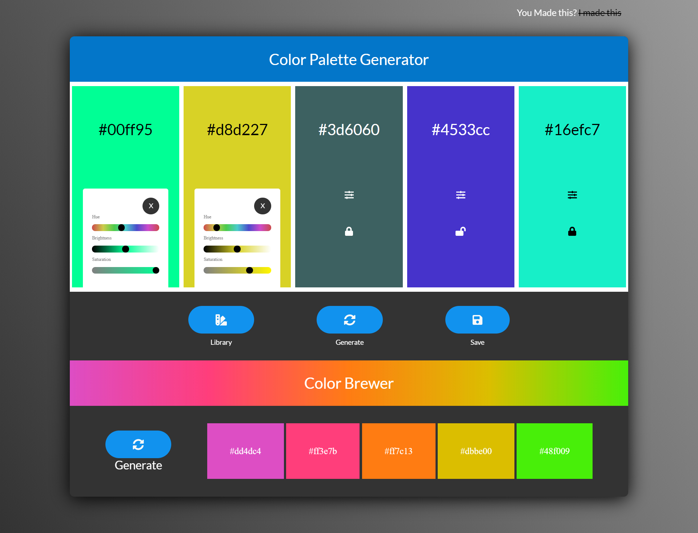

<br />
<p align="center">
  <a href="https://www.thewebsitekitchen.com">
          
  </a>

  <h3 align="center">Color Palette Generator</h3>

  <p align="center">
Create custom Color Palettes  <br />
    <a href="emailto:m90khan@gmail.com"><strong>Contact Me »</strong></a>
    <br />
    <br />
    <a href="https://m90khan.github.io/Color-Palette-Generator/">View Demo</a>
    
   </p>
</p>

## Table of Contents

- [About the Project](#about-the-project)
- [Process](#process)
- [Skills](#skills)
- [Code Snippet](#code)
- [Contact](#Contact)

---

### About the Project

Live: https://m90khan.github.io/Color-Palette-Generator/


##### Process

- Generate Random Colors . <a href="https://gka.github.io/chroma.js/">Chroma.js Used
- Generate Button invokes the color generator program
- Generate 5 random colors and append them to each div[i]
- Change the text based on the colors
- Change the color of the text [black, white] based on the luminance of the generated color background.
- Add functionality to the input sliders for hue, brightness and saturation
- Take the text innertext for the color and change the background of divs based on input change
- Change the text of colors when slider input values are changes

```javascript

! Error: 1
Whenever we change the saturation color to black, we lose the original color.
 and the brightness will either be black or white. and saturation is lost too. The solution would be to create a reference to initial colors . initialcolors array to save colors
```

```javascript

! Error 2:
* When we picked a different color from the input, the  input background does not change
```

- Add copy to clipboard. create a element to store the text ,execCommand to copy then del the element
  and active classes to the copy container for the 'copy to clipboard animation'
- Add the active classes to the setting to toggle sliders panels along with active class to close the panel on close button
- Add the lock functionality check initalcolors before and aafter push colors and add locked class
- Save & Library : create another variable to store multiple objects to save into localstorae
- first create an object of name (input value) , colors (innertext of colors), index number of savePalettes. then we check this to localStorage to check if null then empty else getItem
- Generate Palette for the Library . create elements basedd on the data from Local storage

---

### Skills

- HTML5
- CSS3 - SCSS Syntax
- JavaScript
- API Chroma.js

---

### Code Snippet

```javascript
// sliders colors
function colorizeSliders(color, hue, brightness, saturation) {
  //Scale Saturation
  const noSat = color.set("hsl.s", 0); // desaturate
  const fullSat = color.set("hsl.s", 1); //full saturate
  const scaleSat = chroma.scale([noSat, color, fullSat]); //take a scale out of it
  //Scale Brightness
  const midBright = color.set("hsl.l", 0.5);
  const scaleBright = chroma.scale(["black", midBright, "white"]);
  //Update Input Colors
  saturation.style.backgroundImage = `linear-gradient(to right,${scaleSat(
    0
  )}, ${scaleSat(1)})`;
  brightness.style.backgroundImage = `linear-gradient(to right,${scaleBright(
    0
  )},${scaleBright(0.5)} ,${scaleBright(1)})`;
  hue.style.backgroundImage = `linear-gradient(to right, rgb(204,75,75),rgb(204,204,75),rgb(75,204,75),rgb(75,204,204),rgb(75,75,204),rgb(204,75,204),rgb(204,75,75))`;
}
```

---

### Contact

Reach out to me at one of the following places!

- Website : <a href="https://thewebsitekitchen.com" target="_blank">`thewebsitekitchen.com`</a>
- Linkedin : <a href="https://de.linkedin.com/in/khanmohsinx" target="_blank">`khanmohsinx`</a>

---
