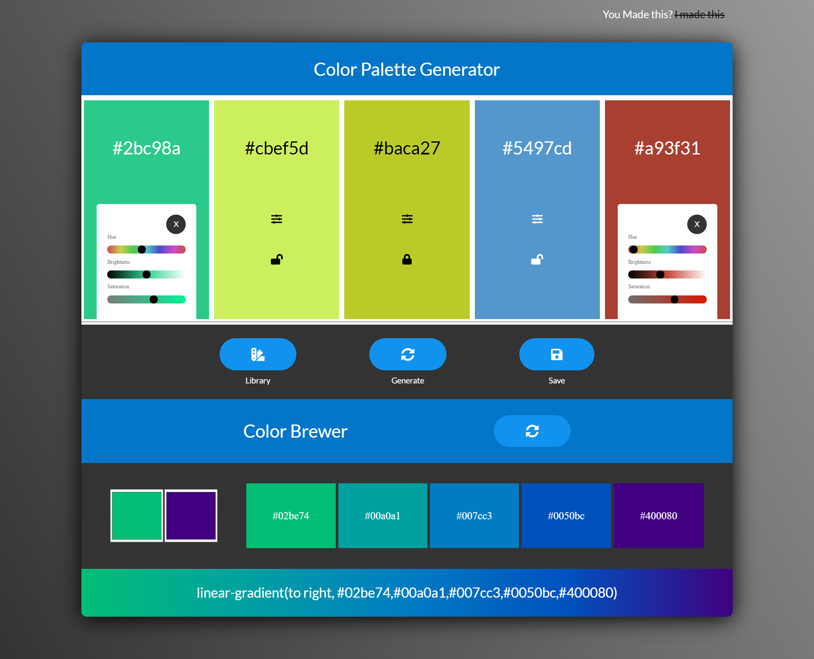

<br />
<p align="center">
  <a href="https://m90khan.github.io/Color-Palette-Generator/">
    
  </a>

  <h3 align="center">Color Palette Generator</h3>

  <p align="center">
Create custom Color Palettes  <br />
    <a href="m90khan@gmail.com"><strong>Contact Me</strong></a>
    <br />
    <br />
    <a href="https://m90khan.github.io/Color-Palette-Generator/">View Demo</a>
    
   </p>
</p>

## Table of Contents

- [About the Project](#about-the-project)
- [Process](#process)
- [Skills](#skills)
- [Code Snippet](#code)
- [Connect With Me](#Contact)

---

### About the Project

- Color Palette Generator and brewer scheme.

Live: https://m90khan.github.io/Color-Palette-Generator/



#### Process

- Generate Button invokes the color generator program
- Generate Random Colors . <a href="https://gka.github.io/chroma.js/">Chroma.js Used </a>
- Generate 5 random colors and append them to each div[i]
- Change the text based on the colors
- Change the color of the text [black, white] based on the luminance of the generated color background.
- Add functionality to the input sliders for hue, brightness, and saturation
- Take the text intertext for the color and change the background of divs based on input change
- Change the text of colors when slider input values are changes
- Add a copy to the clipboard. create an element to store the text,execCommand to copy then del the element
  and active classes to the copy container for the 'copy to clipboard animation'
- Add the active classes to the setting to toggle sliders panels along with active class to close the panel on the close button
- Add the lock functionality check initial colors before and after push colors and add locked class
- Save & Library: create another variable to store multiple objects to save into local storage
- first create an object of the name (input value), colors (intertext of colors), the index number of savePalettes. then we check this to localStorage to check if null then empty else getItem
- Generate Palette for the Library. create elements based on the data from Local storage

```javascript
/*
! Error: 1
Whenever we change the saturation color to black, we lose the original color.
 and the brightness will either be black or white. and saturation is lost too. 
 The solution would be to create a reference to initial colors . initialcolors array to save colors
 */
```

```javascript
/*
! Error 2:
* When we picked a different color from the input, the  input background does not change
*/
```

---

### Skills

[][youtube]
[][youtube]
[][youtube]
[][youtube]
[][youtube]
[][youtube]
[][youtube]
[][youtube]
<br />
<br />

---

### Code Snippet

```javascript
// sliders colors
function colorizeSliders(color, hue, brightness, saturation) {
  //Scale Saturation
  const noSat = color.set('hsl.s', 0); // desaturate
  const fullSat = color.set('hsl.s', 1); //full saturate
  const scaleSat = chroma.scale([noSat, color, fullSat]); //take a scale out of it
  //Scale Brightness
  const midBright = color.set('hsl.l', 0.5);
  const scaleBright = chroma.scale(['black', midBright, 'white']);
  //Update Input Colors
  saturation.style.backgroundImage = `linear-gradient(to right,${scaleSat(0)}, ${scaleSat(
    1
  )})`;
  brightness.style.backgroundImage = `linear-gradient(to right,${scaleBright(
    0
  )},${scaleBright(0.5)} ,${scaleBright(1)})`;
  hue.style.backgroundImage = `linear-gradient(to right, rgb(204,75,75),rgb(204,204,75),rgb(75,204,75),rgb(75,204,204),rgb(75,75,204),rgb(204,75,204),rgb(204,75,75))`;
}
```

---

### Connect with me:

[][youtube]

[][twitter]
[][linkedin]
[][instagram]
[][behance]
[][dribble]
<br />

---

[youtube]: https://www.youtube.com/channel/UC96rVfdTKsjZpREnH6CaCOw
[twitter]: https://twitter.com/m90khan
[linkedin]: https://www.linkedin.com/in/uxdkhan
[instagram]: https://www.instagram.com/uxd.khan/
[behance]: https://www.behance.net/Khan_Mohsin
[dribble]: https://dribbble.com/uxdkhan
